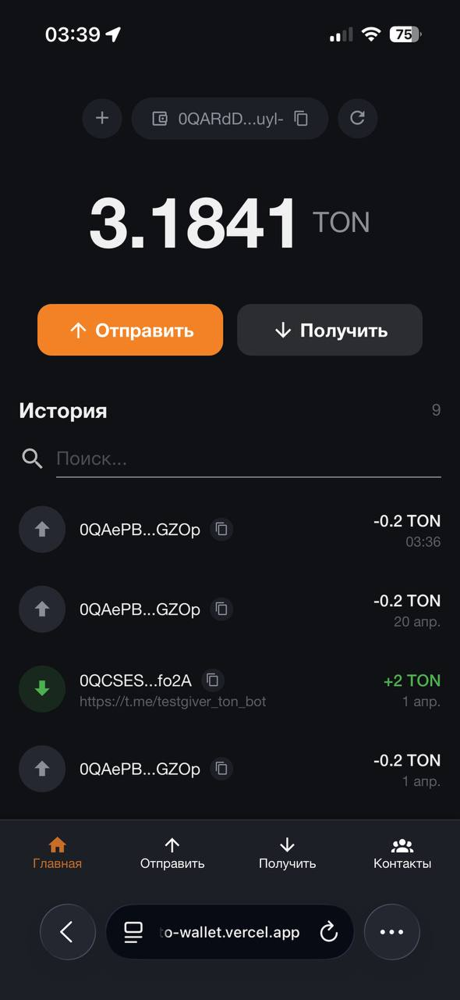
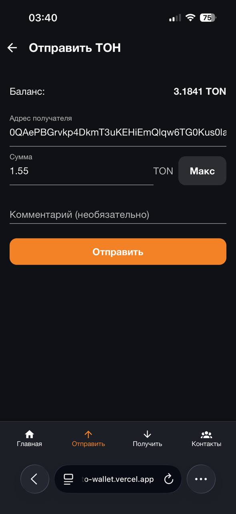
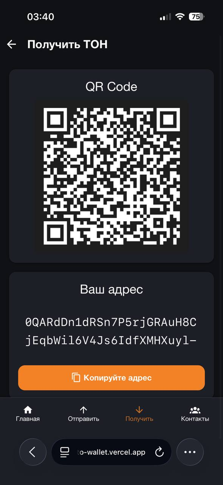
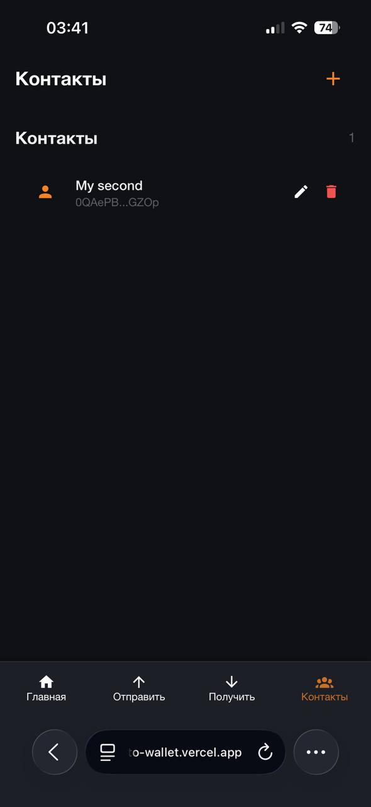

# TON Testnet Wallet

Self-custodial web wallet for TON blockchain (testnet). Frontend-only — no backend, no tracking, keys never leave the browser.

Built as a technical assessment, then extended with improvements based on code review feedback. See **[What I improved after review](#what-i-improved-after-review)** section below — this repo intentionally shows the *process* of iterating on feedback, not just a polished result.

**Live demo:** https://ton-crypto-wallet.vercel.app/
**Stack:** Vue 3 · TypeScript · Vite · Pinia · Tailwind CSS 4 · Vuetify 4 · @ton/ton · @ton/crypto

---

## Screenshots

| Dashboard | Send | Receive | Contacts |
|---|---|---|---|
|  |  |  |  |

---

## Features

- ✅ Create new wallet (24-word mnemonic generation)
- ✅ Import existing wallet (mnemonic validation)
- ✅ Multi-account support (switch between wallets)
- ✅ Balance & transaction history with search
- ✅ Send TON with comprehensive safety warnings
- ✅ Receive with QR code and copy-to-clipboard
- ✅ Address book (contacts CRUD)
- ✅ Dust transaction detection in history
- ✅ Mobile-first responsive UI (Tonkeeper-inspired)

### Safety warnings before sending

The send flow blocks the user with an explicit modal for these scenarios:
- **Address poisoning** — similar address (matching prefix + suffix) found in contacts or history, with character-by-character diff highlighting
- **New address** — sending to an address the wallet has never interacted with before
- **Bounceable address** — sending to an uninitialized bounceable address (funds will be returned)
- **Own address** — attempt to send to the same wallet
- **Entire balance** — no TON left for future transaction fees

---

## Quick start

```bash
git clone https://github.com/Rampagka/ton-self-custodial-wallet
cd ton-self-custodial-wallet
npm install
npm run dev
```

Open http://localhost:8080.

### Getting testnet TON

1. Create a new wallet in the app, copy the address
2. Open [@testgiver_ton_bot](https://t.me/testgiver_ton_bot) in Telegram
3. Send your address, get 2 TON (60 min cooldown)
4. Refresh the dashboard — balance appears in ~30 seconds

### Optional: TON Center API key

Without a key the app uses the free public endpoint with a 1 req/sec limit. For higher throughput:

1. Get a key from [@tontestnetapibot](https://t.me/tontestnetapibot)
2. Create `.env.local`:
```
   VITE_TONCENTER_API_KEY=your_key_here
```

---

## Architecture

### Module system

Each feature is a self-contained module under `src/modules/{name}/` with strict boundaries enforced by `eslint-plugin-project-structure`:

```
src/modules/{name}/
├── index.ts          # Public API — the ONLY entry point for external consumers
├── components/       # Vue components (kebab-case)
├── composables/      # useFoo.ts — reusable reactive logic
├── services/         # Pure functions — API calls, business logic
├── store/            # Pinia stores (*.store.ts)
├── models/           # types/, interfaces/, enums/
└── helpers/          # Utility functions
```

**Cross-module imports are allowed only through the public `index.ts`**, never deep paths. This is enforced by ESLint — if you try to `import { foo } from '@/modules/send/helpers/bar'` from another module, the build fails. It sounds pedantic but it's saved me more times than I can count when refactoring.

### Smart / dumb component split

- `src/common/ui/` — dumb primitives (buttons, inputs). Props + emit only.
- `src/common/components/` — dumb reusable domain components.
- `src/modules/**/-block.vue`, `-card.vue`, `-item.vue` — dumb, data via props.
- `src/pages/` — smart. Orchestrate modules, talk to stores and router.

Business logic lives in composables, not components. Components stay thin.

### Why this structure

I've worked on codebases where everyone imports whatever from wherever, and refactoring becomes a 2-week affair. Enforcing public APIs and a rigid module layout means:

- **New features scale linearly** — you add a new folder, not a new tangle
- **Code review is bounded** — you review one module, not the blast radius
- **Testing surface is clear** — the module's public API is literally in one file

---

## TON integration — key decisions

**Wallet contract:** `WalletContractV5R1` — latest standard, same as Tonkeeper. Uses `networkGlobalId: -3` for testnet (produces different addresses than mainnet from the same mnemonic, which is correct).

**No TonConnect.** TonConnect is for dApps connecting *to* external wallets. This app **is** the wallet — it manages keys directly.

**Wallet deployment.** TON wallets are smart contracts. The first outgoing transaction (with `seqno=0`) auto-deploys the contract via `stateInit`. Users must first receive TON from the faucet before they can send.

**API rate limiting.** All TON Center calls go through a `rateLimited()` wrapper that respects the 1 req/sec free tier limit. This is a singleton queue — no matter how many components call the API concurrently, requests are serialized.

---

## Trade-offs & compromises

This is a testnet assessment, so several decisions favor clarity and development speed over production hardening:

### Mnemonic stored in localStorage

**Compromise:** Encryption-at-rest would require a user-provided password, adding significant UX friction (unlock on every session, password recovery, etc.).
**Production fix:** Encrypt with a password-derived key (PBKDF2 + AES-GCM), prompt for password on app open, auto-lock after inactivity.

### No backend

**Compromise:** Transaction history and balance polling hit TON Center directly from the browser. Rate-limited, so UX can feel slow.
**Production fix:** A thin backend proxy with caching, WebSocket push for real-time updates, indexer for rich transaction metadata.

### Address poisoning detection is prefix+suffix match

**Compromise:** I check first 6 and last 4 characters. Real attackers may use longer matches or Unicode tricks I don't defend against.
**Production fix:** Levenshtein distance, Unicode normalization, block known-malicious address lists, machine-learning anomaly detection.

### Confirmation timeout shows "pending", not "error"

**Compromise (implemented after v1 review):** Initial version threw an error after 60s of seqno polling, which could cause users to re-send an already-broadcast transaction. Now the UI shows "Transaction is taking longer than usual, check TonScan" with a link to the explorer.
**Production fix:** WebSocket subscription to wallet address, confirm via on-chain event instead of polling.

### No TonConnect / hardware wallet support

**Compromise:** Keeping scope narrow — this demo is about the self-custodial flow, not universal wallet integration.
**Production fix:** Add TonConnect as an optional auth method, Ledger support via `@ton-community/ton-ledger`.

---

## What I improved after review

This project was originally submitted as a technical assessment and I received detailed code review feedback. Instead of hiding that, I kept it as a learning document and iterated the codebase against it. The commits tagged `fix(review):` address each point.

| Feedback                                                                           | Status | Commit                                                                   |
|------------------------------------------------------------------------------------|---|--------------------------------------------------------------------------|
| Missing warning for unknown / first-time recipient                                 | ✅ Fixed | `fix(send): add NEW_ADDRESS warning for first-time recipients`           |
| Confirmation copy button copied wrong address (own wallet instead of counterparty) | ✅ Fixed | `fix(dashboard): propagate counterparty address in transaction copy`     |
| False error after 60s seqno timeout (tx may have actually succeeded)               | ✅ Fixed | `fix(send): show pending state instead of error on confirmation timeout` |
| Infinite retry loop with silent failures — skeleton forever on network issues      | ✅ Fixed | `fix(dashboard): bounded retries + error state with manual retry`        |
| README was a Vite template, not a project document                                 | ✅ Fixed | You're reading it                                                        |
| `npm install` failed on peer-dep conflict (eslint 10 vs eslint-plugin-import)      | ✅ Fixed | `chore(test): add Vitest + tests for address-validation helpers`         |
| No tests                                                                           | ✅ Added | `chore(test): add Vitest + tests for address-validation helpers`         |

**Why publish the feedback?** Because in my experience the most useful signal about a developer isn't what they write first — it's how they respond to review. Hiding the iteration would be less honest.

---

## Project structure

```
src/
├── core/                 # App infrastructure (router, configs)
├── common/               # Cross-module shared code (ui, helpers, services)
├── modules/              # Feature modules (see Module system above)
│   ├── wallet/           # Create, import, key management
│   ├── dashboard/        # Balance, transaction history
│   ├── send/             # Send flow with warnings
│   ├── receive/          # Receive screen with QR
│   ├── contacts/         # Address book
│   └── nav-bar/          # Bottom navigation
├── pages/                # Smart route components
├── App.vue
└── main.ts
```

---

## Scripts

| Command | What it does |
|---|---|
| `npm run dev` | Vite dev server with HMR |
| `npm run build` | Type-check + production build |
| `npm run type-check` | `vue-tsc` type checking only |
| `npm run lint` | `oxlint` + `eslint --fix` |
| `npm run format` | Prettier on the whole project |
| `npm run test` | Run Vitest tests |

---

## Tech stack rationale

- **Vue 3 + Composition API + TypeScript** — my primary stack for 4+ years
- **Pinia over Vuex** — cleaner API, better TS inference, lighter
- **Tailwind CSS 4 (@tailwindcss/vite)** — no `tailwind.config.js`, uses `@theme inline` in CSS
- **Vuetify 4** — for dialog / snackbar / skeleton primitives; pulled in more weight than I'd like in retrospect, would use headless UI next time
- **Vite over Webpack** — faster dev loop, no meaningful downside for this scale
- **oxlint + eslint** — oxlint catches 80% of issues in 10% of the time; eslint for what oxlint doesn't cover yet

---

## License

MIT
